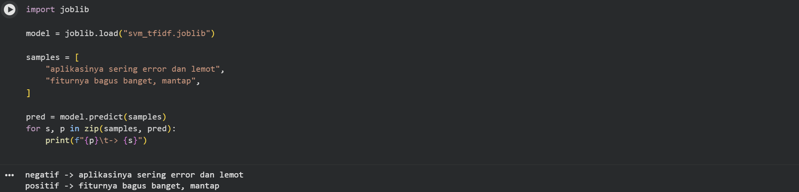

# Analisis Sentimen Ulasan Play Store (Streamlit)

Aplikasi **inference** sederhana untuk memprediksi sentimen (**positif/negatif**) dari teks ulasan Google Play menggunakan model **SVM (LinearSVC) + TF‑IDF**.



## Live demo
- **Local:** http://localhost:8501  
- **Streamlit Community Cloud:** setelah deploy, Streamlit akan memberikan URL publik dengan format seperti:
  `https://<nama-app>-<username>.streamlit.app`

## Fitur
- Prediksi **1 teks** lewat UI Streamlit
- Prediksi **batch** dari file CSV (download hasil)
- Preprocessing teks konsisten dengan notebook training

## Struktur project
```text
.
├─ streamlit_app.py          # entrypoint Streamlit
├─ src/                      # kode utama (preprocess + wrapper model)
├─ models/                   # model joblib
├─ data/                     # contoh dataset mentah
├─ scripts/                  # scraping Play Store
├─ notebooks/                # notebook training
└─ requirements.txt          # dependency untuk deploy/inference
```

## Cara menjalankan (local)

### 1) Siapkan environment
```bash
python -m venv .venv
# Windows:
.venv\Scripts\activate
# macOS/Linux:
source .venv/bin/activate
```

### 2) Install dependency (untuk app)
```bash
pip install -r requirements.txt
```

### 3) Jalankan Streamlit
```bash
streamlit run streamlit_app.py
```

Buka di browser: http://localhost:8501

## Cara deploy ke Streamlit Community Cloud
1. Upload project ini ke **GitHub** (public/private).
2. Buka Streamlit Community Cloud dan pilih **New app**.
3. Pilih repo + branch, lalu set:
   - **Main file path:** `streamlit_app.py`
4. Klik **Deploy** → URL publik akan muncul otomatis di dashboard Streamlit.

> Tips: kalau deploy gagal karena versi Python, Anda bisa set versi Python di Streamlit Cloud (Advanced settings)
> atau gunakan `requirements.txt` ini (dibuat ringan tanpa TensorFlow, dan dipin agar kompatibel dengan file model `.joblib`).

## Scrape data ulasan (opsional)
Script scraping ada di `scripts/scrape_playstore.py`.

Contoh:
```bash
pip install -r requirements-train.txt
python scripts/scrape_playstore.py --app_id com.whatsapp --n 20000 --out data/dataset_raw.csv --lang id --country id
```

## Catatan model
- Label dibuat dari rating bintang:
  - 1–2 ⭐ → **negatif**
  - 4–5 ⭐ → **positif**
- Model menyimpan pipeline:
  - `TfidfVectorizer(ngram_range=(1,2))`
  - `LinearSVC()`

## Lisensi
MIT License. Lihat file [LICENSE](LICENSE).
